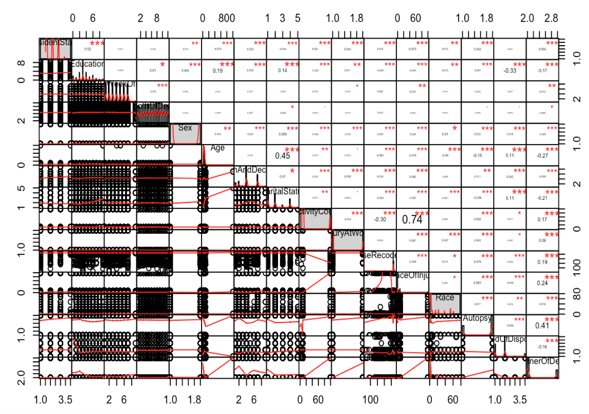

<div align="center">

</div>

> <p dir="RTL"> 
با توجه به سوالات مرگ و میر در آمریکا به سوالات زیر پاسخ دهید.
</p>

***
<p dir="RTL">
ابتدا باید پکیج های مورد نیاز را صدا بزنیم و داده ها را وارد کنیم:
</p>
```{r, eval=FALSE}
library(readr)
library(dplyr)
library(tidyr)
library(Hmisc)
library(corrplot)
library(PerformanceAnalytics)
library(highcharter)
library(ggplot2)
library(ggthemes)
library(caret)
library(car)
library(data.table)
library(ROCR)
library(scales)
library(grid)
library(gridExtra)
library(h2o)


data = read_csv("/Users/kayhan/Desktop/murder_suicide.csv")
```
```{r include=FALSE, cache=FALSE}
library(readr)
library(dplyr)
library(tidyr)
library(Hmisc)
library(corrplot)
library(PerformanceAnalytics)
library(highcharter)
library(ggplot2)
library(ggthemes)
library(caret)
library(car)
library(data.table)
library(ROCR)
library(scales)
library(grid)
library(gridExtra)
library(h2o)


data = read_csv("/Users/kayhan/Desktop/murder_suicide.csv")
```
***

<h5 dir="RTL">
۱. از میان متغیرهای داده مرگ و میر یک زیرمجموعه ایی بدون حشو در نظر بگیرید.
ماتریس همبستگی متغیرهای مختلف را به دست آورده و سپس رسم نمایید. علاوه بر این نمودار پراکنش متغیرهای انتخاب شده را همزمان نسبت به هم رسم نمایید.
</h5>
<h6 dir="RTL">
پاسخ:
</h6>

<p dir="RTL">
در داده ها، از برخی کمیت ها (مانند سن، نژاد، تحصیلات و ...) چند گروه بندی مختلف وجود دارد. با مراجعه به فایل راهنمای متغیرها، از هر کدام یک گروه بندی را انتخاب می کنیم:
</p>
```{r, warning=FALSE}
data %>%
  filter(AgeType==1) %>%
  select(ResidentStatus, Education=Education2003Revision, DayOfWeekOfDeath, MonthOfDeath, 
         Sex, Age, PlaceOfDeathAndDecedentsStatus, MaritalStatus, ActivityCode, InjuryAtWork,
         CauseRecode358, PlaceOfInjury, Race, Autopsy, MethodOfDisposition, MannerOfDeath) ->
  data_subset
```
<p dir="RTL">
سپس متغیرهای کیفی را به عدد تبدیل می کنیم و 
NA 
ها (ردیف هایی که اطلاعات آن موجود نیستند) را حذف می کنیم:
</p>
```{r, warning=FALSE}
data_subset$Sex = as.numeric(factor(data_subset$Sex, levels=c("M","F")))
data_subset$InjuryAtWork = as.numeric(factor(data_subset$InjuryAtWork, levels=c("N","Y")))
data_subset$Autopsy = as.numeric(factor(data_subset$Autopsy, levels=c("N","Y")))
data_subset$MethodOfDisposition = as.numeric(factor(data_subset$MethodOfDisposition,
                                                    levels=c("B","C", "O", "U")))
data_subset$MaritalStatus = as.numeric(factor(data_subset$MaritalStatus, 
                                              levels=c("S","M", "W", "D", "U")))

data_subset %>%
  drop_na()-> data_subset
```

<p dir="RTL">
حالا می توان ماتریس همبستگی ها را حساب کرد:
</p>
```{r, warning=FALSE}
corrMatrix = rcorr(as.matrix(data_subset)) 
```
<p dir="RTL">
و همچنین می توان این ماتریس را نمایش داد:
</p>
```{r, warning=FALSE}
corrplot(corrMatrix$r, method = "square" , type = "lower", order = "original", 
         tl.col = "black", tl.cex=0.5, tl.srt = 45)
```
<p dir="RTL">
همچنین نمودار دوبه دوی پراکنش هم به این صورت است:
</p>
```{r, eval=FALSE}
chart.Correlation(data_subset, histogram=TRUE)
```
<div align="center">

</div>
***

<h5 dir="RTL">
۲. اثر هر یک از متغیرهای جنسیت، نژاد،آموزش، سن و نحوه تدفین را بر مرگ یا خودکشی ارزیابی کنید.
</h5>
<h6 dir="RTL">
پاسخ:
</h6>

<h6 dir="RTL">
الف) جنسیت
</h6>

```{r, warning=FALSE}
data_subset %>%
  group_by(Sex, MannerOfDeath) %>%
  summarise(n=n()) ->sex

sex %>%
  group_by(Sex) %>%
  mutate(percent = n*100/sum(n)) -> sex

sexMatrix = matrix(sex$n, nrow=2, ncol=2, byrow=FALSE)
colnames(sexMatrix) = c("Male", "Female")
rownames(sexMatrix) = c("Suicide", "Murder")

percentageSexMatrix = matrix(sex$percent, nrow=2, ncol=2, byrow=FALSE)
colnames(percentageSexMatrix) = c("Male", "Female")
rownames(percentageSexMatrix) = c("Suicide", "Murder")

hchart(percentageSexMatrix) %>%
  hc_xAxis(title = list(text = "Gender")) %>%
  hc_yAxis(title = list(text = "Type of Death")) %>%
  hc_add_theme(hc_theme_elementary())
```
<p dir="RTL">
همانطور که از نمودار مشخص است، زن ها بیشتر از مردها خودکشی میکنند اما در عوض مردها بیشتر از زن ها به قتل رسیده اند. باید با آزمون فرض مناسب ببینیم که آیا این تفاوت معنادار است یا خیر. از آزمون مربع کای استفاده می کنیم:
</p>
```{r, warning=FALSE}
chisq.test(sexMatrix)
```
<p dir="RTL">
از آنجا که 
p-value 
خیلی کم است، فرض استقلال رد می شود و بنابراین تفاوت ها معنادار است.
</p>

<h6 dir="RTL">
ب) نژاد
</h6>
<p dir="RTL">
همانند بخش قبل:
</p>
```{r, warning=FALSE}
data_subset %>%
  group_by(Race, MannerOfDeath) %>%
  summarise(n=n()) ->race

race %>%
  group_by(Race) %>%
  mutate(percent = n*100/sum(n)) -> race

raceMatrix = matrix(race$n, nrow=14, ncol=2, byrow=TRUE)
colnames(raceMatrix) = c("Suicide", "Murder")
rownames(raceMatrix) = c("White", "Black", "American-Indian",
                         "Chinese", "Japanese", "Hawaiian",
                         "Filipino",
                         "Asian Indian", "Korean", "Samoan", "Vietnamese", "Guamanian",
                         "Other Asian or Pacific Islander in areas reporting codes 18-58",
                         "Combined other Asian or Pacific Islander, includes codes 18-68 for areas that do not report them separately")


percentRaceMatrix = matrix(race$percent, nrow=14, ncol=2, byrow=TRUE)
colnames(percentRaceMatrix) = c("Suicide", "Murder")
rownames(percentRaceMatrix) = c("White", "Black", "American-Indian",
                         "Chinese", "Japanese", "Hawaiian",
                         "Filipino",
                         "Asian Indian", "Korean", "Samoan", "Vietnamese", "Guamanian",
                         "Other Asian or Pacific Islander in areas reporting codes 18-58",
                         "Combined other Asian or Pacific Islander, includes codes 18-68 for areas that do not report them separately")

hchart(percentRaceMatrix) %>%
  hc_xAxis(title = list(text = "Type of Death")) %>%
  hc_yAxis(title = list(text = "Race")) %>%
  hc_add_theme(hc_theme_elementary())

chisq.test(raceMatrix)
```
<p dir="RTL">
که تفاوت ها کاملا معنادار هستند. بیشترین قتل ها علیه سیاهان و کمترین قتل ها علیه ژاپنی ها اتفاق می افتد.
</p>
<h6 dir="RTL">
پ) آموزش (تحصیلات)
</h6>
<p dir="RTL">
همانند بخش قبل:
</p>
```{r, warning=FALSE}
data_subset %>%
  group_by(Education, MannerOfDeath) %>%
  summarise(n=n()) -> edu

edu %>%
  group_by(Education) %>%
  mutate(percent = n*100/sum(n)) -> edu

eduMatrix = matrix(edu$n, nrow=10, ncol=2, byrow=TRUE)
colnames(eduMatrix) = c("Suicide", "Murder")
rownames(eduMatrix) = c("No formal education", "8th grade or less",
                        "9 - 12th grade, no diploma", "high school graduate or GED completed",
                        "some college credit, but no degree", "Associate degree",
                        "Bachelor’s degree", "Master’s degree",
                        "Doctorate or professional degree", "Unknown")

percentEduMatrix = matrix(edu$percent, nrow=10, ncol=2, byrow=TRUE)
colnames(percentEduMatrix) = c("Suicide", "Murder")
rownames(percentEduMatrix) = c("No formal education", "8th grade or less",
                        "9 - 12th grade, no diploma", "high school graduate or GED completed",
                        "some college credit, but no degree", "Associate degree",
                        "Bachelor’s degree", "Master’s degree",
                        "Doctorate or professional degree", "Unknown")

hchart(percentEduMatrix) %>%
  hc_xAxis(title = list(text = "Type of Death")) %>%
  hc_yAxis(title = list(text = "Education")) %>%
  hc_add_theme(hc_theme_elementary())

chisq.test(eduMatrix)
```
<p dir="RTL">
به نظر میرسد افراد از دوره ی بیسوادی تا مقطع ۱۲ ام، هرچه تحصیلات بالاتری دارند، کمتر دست به خودکشی میزنند. اما از کلاس ۱۲ ام تا مقطع دکتری روند عوض می شود و هرچه افراد تحصیلات بالاتری دارند، بیشتر احتمال دارد که خودکشی کرده باشند تا اینکه به قتل برسند. همچنین با توجه به کوچک بودن 
p-value 
تفاوت ها معنادار هستند.
</p>

<h6 dir="RTL">
ت) سن
</h6>
<p dir="RTL">
از آنجا که سن متغیری پیوسته است، روند کار هم در این بخش تفاوت دارد. از آزمون نان-پارامتریک 
wilcoxon 
به همراه نمودارهای مناسب استفاده خواهیم کرد:
</p>

```{r, warning=FALSE}
data_subset %>%
  filter(Age<500) %>%
  select(Age, MannerOfDeath) -> age

age$MannerOfDeath = factor(age$MannerOfDeath, labels=c("Suicide", "Murder"))

age %>%
  group_by(MannerOfDeath) %>%
  summarise(avgAge=mean(Age)) -> tmp

ggplot(tmp, aes(x=MannerOfDeath, y=avgAge)) + geom_col(color="black", fill="blue") + 
  xlab("Type of Death")+
  ylab("Average Age")+
  theme_bw()

age %>%
  ggplot(aes(x = Age, group=MannerOfDeath, fill=MannerOfDeath)) +
  geom_density(alpha = 0.3) +
  xlab("Age") + ylab("Density")+
  theme_bw()

age %>%
  ggplot(aes(x=MannerOfDeath, y=Age, group=MannerOfDeath, fill=MannerOfDeath)) +
  geom_boxplot() + 
  xlab("Type of Death")+
  ylab("Age")+
  theme_bw()

wilcox.test(Age~MannerOfDeath, age)
```
<p dir="RTL">
همانطور که مشخص است، افرادی که خودکشی کرده اند میانگین سنی بالاتری دارند. بنابراین اگر شخصی سن بیشتری داشته باشد، احتمال اینکه خودکشی کرده باشد افزایش می یابد.
</p>

<h6 dir="RTL">
ث) تحوه تدفین
</h6>
<p dir="RTL">
روند کار مشابه ۳ بخش اول است:
</p>
```{r, warning=FALSE}
data_subset %>%
  group_by(MethodOfDisposition, MannerOfDeath) %>%
  summarise(n=n()) -> dispos

dispos %>%
  group_by(MethodOfDisposition) %>%
  mutate(percent = n*100/sum(n)) -> dispos

disposMatrix = matrix(edu$n, nrow=4, ncol=2, byrow=TRUE)
colnames(disposMatrix) = c("Suicide", "Murder")
rownames(disposMatrix) = c("Burial", "Cremation", "Other", "Unknown")

percentDisposMatrix = matrix(edu$percent, nrow=4, ncol=2, byrow=TRUE)
colnames(percentDisposMatrix) = c("Suicide", "Murder")
rownames(percentDisposMatrix) = c("Burial", "Cremation", "Other", "Unknown")

hchart(percentDisposMatrix) %>%
  hc_xAxis(title = list(text = "Type of Death")) %>%
  hc_yAxis(title = list(text = "Method of Disposition")) %>%
  hc_add_theme(hc_theme_elementary())

chisq.test(disposMatrix)
```
<p dir="RTL">
همانطور که مشخص است، کسانی که دفن شده اند، نرخ بالاتری در خودکشی نسبت به کسانی که سوزانده شده اند دارند. این امر احتمالا مربوط به مسائل فرهنگی است.
</p>
***

<h5 dir="RTL">
۳. با استفاده از مدل رگرسیون لاجستیک یک مدل به داده ها برازش دهید و سپس آن را نقص یابی کنید.
</h5>

<h6 dir="RTL">
پاسخ:
</h6>

<p dir="RTL">
مدل لاجستیک خود را با تمام متغیرهای غیرحشو ممکن میسازیم:
</p>

```{r, warning=FALSE}
data %>%
  filter(AgeType==1 & Age<500) %>%
  select(ResidentStatus, Education=Education2003Revision, DayOfWeekOfDeath, MonthOfDeath, 
         Sex, Age, PlaceOfDeathAndDecedentsStatus, MaritalStatus, ActivityCode, InjuryAtWork,
         CauseRecode358, PlaceOfInjury, Race, Autopsy, MethodOfDisposition, MannerOfDeath) ->
  data_subset

data_subset$MannerOfDeath = data_subset$MannerOfDeath - 2

mylogit = glm(MannerOfDeath ~ ResidentStatus + Education + DayOfWeekOfDeath + MonthOfDeath + Sex +
                              Age + PlaceOfDeathAndDecedentsStatus + MaritalStatus + ActivityCode + 
                              InjuryAtWork + CauseRecode358 + MethodOfDisposition,
                              family = "binomial", data=data_subset)
summary(mylogit)
```
<p dir="RTL">
سپس متغیرهای غیرشاخص را از مدل خود حذف می کنیم:
</p>
```{r, warning=FALSE}
mylogit2 = glm(MannerOfDeath ~ ResidentStatus + Education + DayOfWeekOfDeath + Sex +
                 Age + PlaceOfDeathAndDecedentsStatus + MaritalStatus + ActivityCode + 
                 InjuryAtWork + CauseRecode358 + MethodOfDisposition,
                 family = "binomial", data=data_subset)
summary(mylogit2)
```
<p dir="RTL">
برای اینکه ببینیم آیا مدل دوم به خوبی مدل اول کار می کند یا نه، باید از آزمون فرض مربع کای استفاده کنیم:
</p>
```{r, warning=FALSE}
anova(mylogit, mylogit2, test="Chisq")
```
<p dir="RTL">
بالا بودن 
p-value 
نشان دهنده ی این است که مدل دوم به خوبی مدل اول کار می کند
</p>
<p dir="RTL">
در مدل های
GLM، 
متاسفانه توافق کمتری برای روش های استاندارد نقص یابی نسبت به مدل های 
LM 
وجود دارد. یکی از نمودارهای متعارف برای نقص یابی، به صورت زیر است:
</p>

```{r, warning=FALSE}
plot(predict(mylogit, type="response"), residuals(mylogit, type= "deviance"))
```
<p dir="RTL">
یکی دیگر از این نمودار ها، به صورت زیر است:
</p>
```{r, warning=FALSE}
influencePlot(mylogit2)
```
<p dir="RTL">
همچنین می توان به نمودار های رایج نقصیابی که در مدل های خطی نگاه کردیم هم نگاه کنیم:
</p>
```{r, warning=FALSE}
par(mfrow=c(2,2))
plot(mylogit) 
```
<p dir="RTL">
اما باید توجه داشت که این نمودارها وقتی مفیدند که 
Response-Variable 
تعداد زیادی از مقادیر را اختیار کند. در مدل های لاجستیک که این اتفاق نمی افتد، کارایی این نمودارها کاهش می یابد
</p>
***

<h5 dir="RTL">
۴. با استفاده از سه نمودار خروجی مدل را نسبت به داده واقعی ارزیابی کنید.
</h5>
<h6 dir="RTL">
پاسخ:
</h6>
<p dir="RTL">
ابتدا پیش بینی مدل خود را وارد داده ها می کنیم:
</p>
```{r, warning=FALSE}
mylogit = mylogit2
data_subset = data_subset %>% mutate(pred = fitted(mylogit)) 
```
<p dir="RTL">
می توان ابتدا برای بررسی خوب بودن مدل، به همان نمودارهای نقص یابی مانند سوال قبل نگاه کرد:
</p>
```{r, warning=FALSE}
par(mfrow=c(2,2))
plot(mylogit) 
```
<p dir="RTL">
به عنوان گروه اول از نمودار ها، می توان به میزان پیش بینی بر حسب مقدار یکی از متعیرهای دخیل در مدل نگاه کرد:
</p>
```{r, warning=FALSE}
mylogit = mylogit2
data_subset %>% 
  mutate(pred=fitted(mylogit)) -> tmp

tmp = data_subset %>% mutate(pred = fitted(mylogit)) 
ggplot(tmp,aes(x=Age, y=pred, col=MannerOfDeath))+
  geom_point() +
  ylab("Prediction") + theme_bw()
```
<p dir="RTL">
که می توان ترند کلی پیش بینی بر اساس سن فرد را نگاه کرد
</p>
<p dir="RTL">
به عنوان نمودار دوم، نمودار توزیع پیش بینی برای دو گروه قتل ها و خودکشی ها را نگاه میکنیم:
</p>
```{r, warning=FALSE}
ggplot(data_subset, aes(x=pred, y= ..density.., color=as.factor(MannerOfDeath))) +
  geom_density(size=1) +
  scale_color_economist(name="Type of Death", labels = c("Suicide", "Murder")) +
  xlab("Prediction")+
  ylab("Count")+
  theme_bw()
```
<p dir="RTL">
که دو تابع توزیع، تا حد نسبتا خوبی از هم جدا شده اند و مدل ما نسبتا خوب کار می کند. به عنوان نمودار سوم هم میتوان به نمودار تایل-پلات داده های پیش بینی بر حسب داده های واقعی نگاه کرد:
</p>
```{r, warning=FALSE}
as.data.frame(table(data_subset$MannerOfDeath,ifelse(fitted(mylogit)>0.5,1,0))) -> pred
colnames(pred) = c("Data", "Prediction", "Freq")
predMatrix = matrix(pred$Freq, nrow=2, ncol=2, byrow=TRUE)
colnames(predMatrix) = c("Suicide", "Murder")
rownames(predMatrix) = c("Suicide", "Murder")
hchart(predMatrix) %>%
  hc_xAxis(title = list(text = "Type of Death")) %>%
  hc_yAxis(title = list(text = "Prediction")) %>%
  hc_add_theme(hc_theme_elementary())
```
<p dir="RTL">
توجه کنید که برای رسم این نمودار، کات-آف را برابر با ۰.۵ فرض کرده ایم.
همانطور که مشخص است، دو گروه 
TP 
و 
TN 
بیشت از دو گروه دیگر 
FP 
و 
FN 
عضو دارند که نشانگر این است که مدل ما نسبتا خوب کار می کند.
</p>
***

<h5 dir="RTL">
۵. ابتدا ۲۰ درصد داده را به صورت تصادفی به عنوان تست در نظر بگیرید. مدل را با استفاده از ۸۰ درصد باقی مانده برازش دهید. با استفاده از پارامتر قطع ۰.۵ نتایج را برای داده تست پیش بینی کنید. سپس کمیت های زیر را محاسبه کنید.
</h5>

<h5>
* P: positive samples
* N: negative samples
* TP: true positive TP (eqv. with hit)
* TN: true negative (eqv. with correct rejection)
* FP: false positive (eqv. with false alarm, Type I error)
* FN: false negative (eqv. with miss, Type II error)
* Accuracy (ACC) ACC = (TP+TN)/(P+T)
* False positive rate (FPR): 1- TN/N
* True positive rate (TPR): TP/P
</h5>

<h5 dir="RTL">
مشابه آنچه در کلاس گفته شد نمایشی از  چهار کمیت 
TN, TP,FP,FN
به همراه داده ها رسم نمایید.
</h5>
<h6 dir="RTL">
پاسخ:
</h6>

<p dir="RTL">
ابتدا داده ها را به ۵ قسمت تقسیم میکنیم و ۴ قسمت را برای 
train 
و ۱ قسمت را برای تست در نظر می گیریم:
</p>

```{r, warning=FALSE}
data %>%
  filter(AgeType==1) %>%
  select(ResidentStatus, Education=Education2003Revision, DayOfWeekOfDeath, MonthOfDeath, 
         Sex, Age, PlaceOfDeathAndDecedentsStatus, MaritalStatus, ActivityCode, InjuryAtWork,
         CauseRecode358, PlaceOfInjury, Race, Autopsy, MethodOfDisposition, MannerOfDeath) ->
  data_subset

data_subset$MannerOfDeath = data_subset$MannerOfDeath - 2

index = sample(x= 1:nrow(data_subset), size = 0.8*nrow(data_subset), replace = F)
train = data_subset[index,] 
test =  data_subset[-index,]
train = na.omit(train)
```

<p dir="RTL">
حالا می توانیم مدل را روی بخش 
train 
بسازیم:
</p>
```{r, warning=FALSE}
mylogit = glm(MannerOfDeath ~ ResidentStatus + Education + DayOfWeekOfDeath + Sex +
                 Age + PlaceOfDeathAndDecedentsStatus + MaritalStatus + ActivityCode + 
                 InjuryAtWork + CauseRecode358 + MethodOfDisposition,
               family = "binomial", data=data_subset)
summary(mylogit)
```
<p dir="RTL">
سپس مدل را برای پیش بینی 
test 
با پارامتر قطع ۰.۵ به کار میبریم:
</p>
```{r, warning=FALSE}
train$prediction = predict(mylogit, newdata=train, type="response")

test$prediction  = predict(mylogit, newdata=test , type="response")
test = na.omit(test)

test %>%
  mutate(pred = ifelse(prediction>0.5,1,0),
         status=ifelse(MannerOfDeath==0 & pred==0,"TP",
                       ifelse(MannerOfDeath==0 & pred==1,"FP",
                              ifelse(MannerOfDeath==1 & pred==0,"FN","TN")))) -> test
test %>%
  group_by(status) %>%
  summarise(n=n()) -> tmp

P   = tmp$n[tmp$status=="FP"] +  tmp$n[tmp$status=="TP"]
N   = tmp$n[tmp$status=="FN"] +  tmp$n[tmp$status=="TN"]
TP  = tmp$n[tmp$status=="TP"]
TN  = tmp$n[tmp$status=="TN"]
FP  = tmp$n[tmp$status=="FP"]
FN  = tmp$n[tmp$status=="FN"]
ACC = (TP+TN)/(P+N)
FPR = 1 - (TN/N)
TPR = TP/P
```
<p dir="RTL">
که مقدار هریک از پارامترهای خواسته شده برابر است با:
</p>
```{r, warning=FALSE}
P
N
TP
TN
FP
FN
ACC
FPR
TPR
```
<p dir="RTL">
همچنین برای رسم نمودار مناسب، می توان از تابع زیر استفاده کرد:
</p>
```{r, warning=FALSE}
ConfusionMatrixInfo <- function( data, predict, actual, cutoff )
{	
  # extract the column ;
  # relevel making 1 appears on the more commonly seen position in 
  # a two by two confusion matrix	
  predict <- data[[predict]]
  actual  <- relevel( as.factor( data[[actual]] ), "1" )
  
  result <- data.table( actual = actual, predict = predict )
  
  # caculating each pred falls into which category for the confusion matrix
  result[ , type := ifelse( predict >= cutoff & actual == 1, "TP",
                            ifelse( predict >= cutoff & actual == 0, "FP", 
                                    ifelse( predict <  cutoff & actual == 1, "FN", "TN" ) ) ) %>% as.factor() ]
  
  # jittering : can spread the points along the x axis 
  plot <- ggplot( result, aes( actual, predict, color = type ) ) + 
    geom_jitter(shape = 1) + 
    geom_hline( yintercept = cutoff, color = "blue", alpha = 0.6 ) + 
    scale_y_continuous( limits = c( 0, 1 ) ) + 
    scale_color_discrete( breaks = c( "TP", "FN", "FP", "TN" ) ) + # ordering of the legend 
    guides( col = guide_legend( nrow = 2 ) ) + # adjust the legend to have two rows  
    ggtitle( sprintf( "Confusion Matrix with Cutoff at %.2f", cutoff ) )+
    geom_violin( fill = "black", color = NA , alpha=0.7)+
    theme_bw()
  
  return( list( data = result, plot = plot ) )
}

cm_info = ConfusionMatrixInfo(data=test, predict="prediction", actual="MannerOfDeath",
                              cutoff = .5 )
cm_info$plot
```

***

<h5 dir="RTL">
۶. نمودار صحت مدل (accuracy) را بر حسب مقادیر مختلف قطع برای داده تست رسم نمایید. کدام پارامتر قطع بالاترین صحت را در پیش بینی داراست؟
</h5>
<h6 dir="RTL">
پاسخ:
</h6>
<p dir="RTL">
نمودار 
Accuracy 
بر حسب 
Cutoff 
به صورت زیر است:
</p>
```{r, warning=FALSE}
predTest <-  prediction(test$prediction,test$MannerOfDeath)
acc.perf = performance(predTest, measure = "acc")
acc=data.frame(x1=as.vector(slot(acc.perf, "x.values")), y1=as.vector(slot(acc.perf, "y.values")))
colnames(acc) = c("X", "Y")
ggplot(acc, aes(x=X, y=Y)) + geom_line() +
  xlab("Cutoff") + 
  ylab("Accuracy")+ 
  theme_bw()
```
<p dir="RTL">
برای مقایسه ی همین نمودار در بخش 
test 
و بخش 
train 
هم میتوان از تابع زیر استفاده کرد:
</p>
```{r, warning=FALSE}
AccuracyCutoffInfo <- function( train, test, predict, actual )
{
  # change the cutoff value's range as you please 
  cutoff <- seq( 0, 1, by = .01 )
  
  accuracy <- lapply( cutoff, function(c)
  {
    # use the confusionMatrix from the caret package
    cm_train <- confusionMatrix(  as.factor(train[[predict]] > c ), as.factor(train[[actual]]==1) )
    cm_test  <- confusionMatrix( as.factor(test[[predict]]  > c ), as.factor(test[[actual]]==1)  )
    
    dt <- data.table( cutoff = c,
                      train  = cm_train$overall[["Accuracy"]],
                      test   = cm_test$overall[["Accuracy"]] )
    return(dt)
  }) %>% rbindlist()
  
  # visualize the accuracy of the train and test set for different cutoff value 
  # accuracy in percentage.
  accuracy_long <- gather( accuracy, "data", "accuracy", -1 )
  
  plot <- ggplot( accuracy_long, aes( cutoff, accuracy, group = data, color = data ) ) + 
    geom_line() + geom_point() +
    scale_y_continuous() +
    ggtitle( "Train/Test Accuracy for Different Cutoff" ) + 
    xlab("Cutoff") + 
    ylab("Accuracy")+ 
    theme_bw()
  
  return( list( data = accuracy, plot = plot ) )
}
accuracy_info = AccuracyCutoffInfo( train = train, test = test, 
                                    predict = "prediction", actual = "MannerOfDeath" )
accuracy_info$plot
```
<p dir="RTL">
همچنین پارامتر قطعی که در آن بیشترین 
Accuracy 
اتفاق می افتد در داده ی 
test 
برابر است با:
</p>
```{r, warning=FALSE}
ind = which.max(slot(acc.perf, "y.values")[[1]])
acc = slot(acc.perf, "y.values")[[1]][ind]
cutoff = slot(acc.perf, "x.values")[[1]][ind]
print(c(accuracy= acc, cutoff = cutoff))
```
***

<h5 dir="RTL">
۷. نمودار 
ROC
 را برای داده های قسمت قبل رسم نمایید. همچنین نقطه مربوط به بهترین پارامتر قطع را مشخص نمایید.
</h5>
<h6 dir="RTL">
پاسخ:
</h6>
<p dir="RTL">
برای رسم نمودارهای 
ROC 
می توان از تابع زیر استفاده کرد:
</p>
```{r, warning=FALSE}
ROCInfo <- function( data, predict, actual, cost.fp, cost.fn )
{
  # calculate the values using the ROCR library
  # true positive, false postive 
  pred <- prediction( data[[predict]], data[[actual]] )
  perf <- performance( pred, "tpr", "fpr" )
  roc_dt <- data.frame( fpr = perf@x.values[[1]], tpr = perf@y.values[[1]] )
  
  # cost with the specified false positive and false negative cost 
  # false postive rate * number of negative instances * false positive cost + 
  # false negative rate * number of positive instances * false negative cost
  cost <- perf@x.values[[1]] * cost.fp * sum( data[[actual]] == 0 ) + 
    ( 1 - perf@y.values[[1]] ) * cost.fn * sum( data[[actual]] == 1 )
  
  cost_dt <- data.frame( cutoff = pred@cutoffs[[1]], cost = cost )
  
  # optimal cutoff value, and the corresponding true positive and false positive rate
  best_index  <- which.min(cost)
  best_cost   <- cost_dt[ best_index, "cost" ]
  best_tpr    <- roc_dt[ best_index, "tpr" ]
  best_fpr    <- roc_dt[ best_index, "fpr" ]
  best_cutoff <- pred@cutoffs[[1]][ best_index ]
  
  # area under the curve
  auc <- performance( pred, "auc" )@y.values[[1]]
  
  # normalize the cost to assign colors to 1
  normalize <- function(v) ( v - min(v) ) / diff( range(v) )
  
  # create color from a palette to assign to the 100 generated threshold between 0 ~ 1
  # then normalize each cost and assign colors to it, the higher the blacker
  # don't times it by 100, there will be 0 in the vector
  col_ramp <- colorRampPalette( c( "green", "orange", "red", "black" ) )(100)   
  col_by_cost <- col_ramp[ ceiling( normalize(cost) * 99 ) + 1 ]
  
  roc_plot <- ggplot( roc_dt, aes( fpr, tpr ) ) + 
    geom_line( color = rgb( 0, 0, 1, alpha = 0.3 ) ) +
    geom_point( color = col_by_cost, alpha = 0.2 ) + 
    geom_segment( aes( x = 0, y = 0, xend = 1, yend = 1 ), alpha = 0.8, color = "royalblue" ) + 
    labs( title = "ROC", x = "False Postive Rate", y = "True Positive Rate" ) +
    geom_hline( yintercept = best_tpr, alpha = 0.8, linetype = "dashed", color = "steelblue4" ) +
    geom_vline( xintercept = best_fpr, alpha = 0.8, linetype = "dashed", color = "steelblue4" ) + 
    theme_bw()
  
  cost_plot <- ggplot( cost_dt, aes( cutoff, cost ) ) +
    geom_line( color = col_by_cost, alpha = 0.5 ) +
    geom_point( color = col_by_cost, alpha = 0.5 ) +
    ggtitle( "Cost" ) +
    scale_y_continuous( labels = comma ) +
    geom_vline( xintercept = best_cutoff, alpha = 0.8, linetype = "dashed", color = "steelblue4" ) +
    xlab("Cutoff") + ylab("Cost")+
    theme_bw()
  
  # the main title for the two arranged plot
  sub_title <- sprintf( "Cutoff at %.2f - Total Cost = %f, AUC = %.3f", 
                        best_cutoff, best_cost, auc )
  
  # arranged into a side by side plot
  plot <- arrangeGrob( roc_plot, cost_plot, ncol = 2, 
                       top = textGrob( sub_title, gp = gpar( fontsize = 16)))
  
  return( list( plot 		  = plot, 
                cutoff 	  = best_cutoff, 
                totalcost   = best_cost, 
                auc         = auc,
                sensitivity = best_tpr, 
                specificity = 1 - best_fpr ) )
}

cost_fp = 1
cost_fn = 1
roc_info = ROCInfo( data = cm_info$data, predict = "predict", 
                    actual = "actual", cost.fp=cost_fp, cost.fn=cost_fn )
grid.draw(roc_info$plot)
```
<p dir="RTL">
در اینجا فرض کرده ایم که هزینه های مربوط به خطای نوع اول و خطای نوع دوم برابر است. در غیر این صورت می توان با تنظیم متغیرهای 
cost_fp 
که مربوط به هزینه ی خطای نوع اول است و همچنین متغیر 
cost_fn 
که مربوط به هزینه ی خطای نوع دوم است، بهترین 
Cutoff 
را پیدا کرد.
</p>
***

<h5 dir="RTL">
۸. با قرار دادن کمیت 
nfolds = 5
و با استفاده از 
H20
مدل مساله را بسازید و نتیجه حاصل را ارزیابی کنید.
</h5>
<h6 dir="RTL">
پاسخ:
</h6>
```{r, warning=FALSE}
h2o.init(nthreads = -1)
h2o.no_progress()
hdata = as.h2o(data_subset)
chglm = h2o.glm(y = "MannerOfDeath", x= c("ResidentStatus", "Education", "DayOfWeekOfDeath",
                                          "Sex", "Age", "PlaceOfDeathAndDecedentsStatus", 
                                          "MaritalStatus", "ActivityCode", "InjuryAtWork",
                                          "CauseRecode358", "MethodOfDisposition"),
                training_frame = hdata, family="binomial",nfolds = 5)
chglm
```

```{r, warning=FALSE}
h2o.shutdown(prompt = FALSE)
```
<p dir="RTL">
نتیجه ی حاصل همانند روند کلی است که خودمان پیش از این طی کردیم. منتها به این دلیل که محاسبات روی کلاستر خود 
H2O 
انجام می شود و سپس نتیجه به ما ارسال می شود، ران تایم برنامه بسیار کمتر است و برای کار با داده های حجیم تر، ارجحیت دارد.
</p>
***

<h5 dir="RTL"> 
۹. آیا ما میتوانیم سرویسی به قضات ارایه کنیم تا با استفاده از اطلاعات مرگ بتوانند موارد مشکوک به قتل را از خودکشی تفکیک دهند؟
</h5>
<h6 dir="RTL">
پاسخ:
</h6>
<p dir="RTL">
دادگاه، با شواهد قطعی و انکارناپذیر سر و کار دارد. سیستمی که صرفا بر اساس مشخصات فردی و جایگاه اجتماعی بخواهد بر اساس مقایسه با اطلاعات سایرین به حکم دادن بپردازد، سیستم محکمه پسندی نیست. در مدل خودمان، دیدیم که دقتش بالاتر از ۰.۹ است. ینی از هر ۱۰۰ مورد، بیشتر از ۹۰ مورد را درست پیش بینی می کند. اما تکلیف حقوق افرادی که اشتباه پیش بینی میشوند چیست؟
</p>
<p dir="RTL">
البته می توان از این سیستم برای کارآگاه ها و محققین جنایی، در زمینه ی اینکه تحقیقاتشان را به چه سمتی معطوف کنند استفاده کرد. در این حالت کارآگاه ها، با احتمال بسیار بالایی حقیقت را میدانند و در پی جمع آوری شواهد و مدارک بر می آیند. اما اینکه صرفا بر اساس پیش بینی این سیستم، شخصی گناهکار قلمداد شود به دور از حقوق انسانی است.
</p>
<p dir="RTL">
در واقع در حال حاضر هم تحقیقات زیادی بر استفاده از این سیستم در دستگاه های قضایی و امنیتی جاری است. از آنجا که فرض بر بی گناهی افراد است و برای سیستم قضایی مهم است که هیچ فرد بی گناهی در زندان نباشد، بنابراین باید موارد 
FP 
(خطای نوع اول) را کاهش داد. 
در این خصوص می توان تا حدی حطای نوع دوم را قربانی کرد تا خطای نوع اول کم شود (چند مجرم اگر آزاد باشند بهتر از آن است که یک بیگناه در زندان باشد). اما همواره باید با مراقبت، مطالعه، آگاهی از شرایط و شک و تردید از این سیستم استفاده کرد.
</p>
